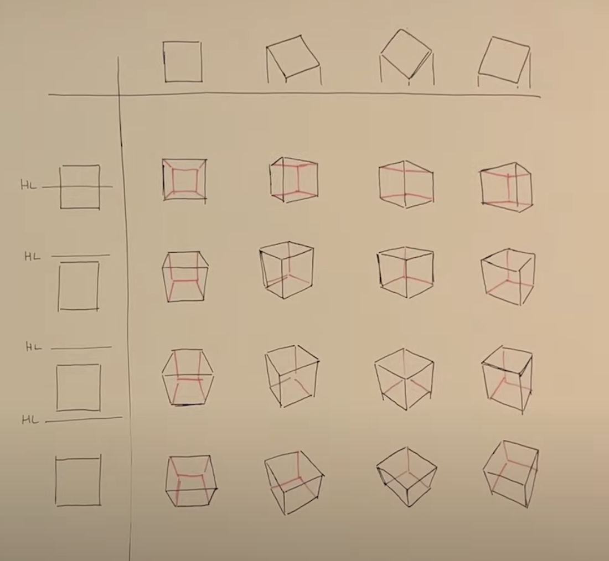
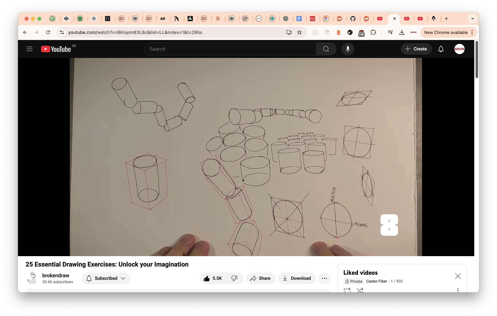

Amsterdam two bedrooms for one guest with parking, wifi and iron budget 300-1600$ for 10 days from 20 of December

2 persons pet friendly apartment with coffee machine in Berlin for a week from tomorrow

Barcelona apartment for 10 days from 20th of December 100$-150$ from preferred suppliers

Instant Flat in Mumbai for 1 night from next Friday 

One or two rooms apartment in Paris with balcony and Apple TV for January 

The process of rendering a web page in a browser involves several steps. These steps take your HTML, CSS, JavaScript, and other resources and transform them into a visible, interactive page. Here's a detailed breakdown:

1. Navigation

* Trigger: User enters a URL, clicks a link, or performs an action that initiates navigation.
* DNS Resolution: The browser resolves the domain name into an IP address.
* Connection Setup: The browser establishes a connection to the server, typically using protocols like TCP and TLS (for HTTPS).

2. Resource Fetching

* Request: The browser sends an HTTP request to the server for the requested resource (e.g., HTML).
* Response: The server responds with the HTML document and possibly additional resources (CSS, JavaScript, images).
* Caching: The browser checks its cache to determine if it can reuse previously fetched resources.

3. Parsing
   3.1 HTML Parsing

* The browser parses the HTML document into a Document Object Model (DOM), a tree-like structure representing the page's content and elements.
* As the HTML is parsed:
       *It encounters references to external resources (CSS, JavaScript, images).*
       It begins downloading these resources concurrently.
  3.2 CSS Parsing
* The browser parses CSS files and inline styles into a CSSOM (CSS Object Model), representing the styles to apply to the DOM elements.
  3.3 JavaScript Parsing
* JavaScript is parsed and executed.
* If a <script> tag without the async or defer attribute is encountered, HTML parsing pauses until the script is fetched and executed (render-blocking behavior).

4. DOM and CSSOM Construction

* The DOM and CSSOM are combined to create the Render Tree:

  * The render tree contains visual elements, excluding elements like <head> or <script>, which do not produce visual output.

5. Layout (Reflow)

* The browser calculates the size and position of each element in the render tree based on:

  * The viewport size.
  * CSS styles.
  * Relationships between elements.
* This step determines where each element will appear on the page.

6. Painting

* The browser paints the pixels for each node in the render tree onto the screen.
* This involves applying:

  * Colors.
  * Textures.
  * Shadows.
  * Other visual effects.

7. Compositing

* The browser divides the page into layers (e.g., overlapping elements or elements with z-index).
* It combines these layers to produce the final visual representation.
* GPU acceleration may be used for compositing, especially for animations or complex visual effects.

8. Interaction Handling

* After the initial render, the browser continues to handle user interactions (e.g., clicks, scrolling, typing).
* JavaScript Execution:

  * Event listeners and dynamic updates to the DOM are processed.
  * Changes may trigger re-layout, re-painting, or compositing.

Optimization Techniques

* Critical Rendering Path:

  * Minimize render-blocking resources.
  * Use async or defer attributes for JavaScript.
* Lazy Loading:

  * Load non-critical resources only when needed (e.g., images or scripts for below-the-fold content).
* CSS Optimization:

  * Minify and reduce unused CSS to speed up CSSOM creation.
* Preloading:

  * Use <link rel="preload"> or <link rel="prefetch"> for critical resources.

\
\
Summary Flow

1. Navigation.
2. Resource Fetching.
3. Parsing (HTML → DOM, CSS → CSSOM, JS Execution).
4. DOM + CSSOM → Render Tree.
5. Layout (Element Positions & Sizes).
6. Painting (Drawing Pixels).
7. Compositing (Combining Layers).
8. User Interaction & Updates.
